<div align="center">

# glass-ripple

**The hero effect for the AI agent era.**

Every AI company needs a landing page that feels alive. Glass-ripple is an 11-pass WebGL2 shader pipeline that turns any `<canvas>` into a reactive, physical surface — with real-time wave physics, CRT retro aesthetics, and 52+ built-in brand icons for the entire AI ecosystem.

[](./LICENSE)
[](https://www.typescriptlang.org/)
[]()
[](https://threejs.org/)
[]()

<br />


<br />

[GitHub](https://github.com/ZenAlexa/glass-ripple) · [Report Bug](https://github.com/ZenAlexa/glass-ripple/issues)

</div>

---

## Why glass-ripple?

2026 is the year AI agents went mainstream. Claude, GPT, Gemini, DeepSeek, Grok — new models and agent frameworks ship every week. But their landing pages? Still the same static gradients and floating particles from 2023.

Glass-ripple fixes that. Drop it into any page and your hero section becomes a **living, breathing surface** — one that responds to every mouse movement with real water physics, light refraction, halftone textures, and CRT scanlines. All computed on the GPU. All in a single `<canvas>`.

**Built for the agent era:** 52 AI brand icons ship out of the box — from Claude to DeepSeek, from Cursor to Cloudflare Workers AI. Swap icons at runtime with a single call. Build agent dashboards, AI product pages, or model comparison UIs that actually feel like the future.

## Quick Start

```bash
npm install glass-ripple three
```

```ts
import { GlassRipple } from 'glass-ripple';
import { claude } from 'glass-ripple/icons';

const ripple = new GlassRipple({
  canvas: document.getElementById('canvas') as HTMLCanvasElement,
  icon: claude.icon,
});
```

Three lines. Zero config. Ship it.

## Features

- **11-pass shader pipeline** — wave sim → normal map → blur → composite → halftone ×2 → chromatic aberration → CRT → vignette
- **Real-time wave physics** — 2D wave equation at ¼ resolution with continuous mouse wake via line-segment distance
- **52+ AI ecosystem icons** — models, agents, dev tools, creative AI, cloud infra. Tree-shakeable, import only what you need
- **Runtime everything** — swap icons, tint colors, toggle effects, adjust wave physics — all live, no reload
- **TypeScript-first** — full type definitions, discriminated union for icon configs, async-aware API
- **Single `<canvas>`** — no extra DOM, no iframes, no dependencies beyond Three.js
- **Extensible** — bring any SVG path or full SVG markup. The 52 built-ins are just the start — PRs for new icons land in hours

## Shader Pipeline

```mermaid
graph LR
    A[Base Texture] --> B[Wave Sim<br><i>¼ res ping-pong</i>]
    B --> C[Normal Map]
    C --> D[Blur<br><i>H + V</i>]
    D --> E[Composite<br><i>refraction + specular</i>]
    E --> F[Halftone x2]
    F --> G[Chromab]
    G --> H[CRT]
    H --> I[Vignette]
    I --> J[Screen]

    style A fill:#1a1a2e,stroke:#666,color:#fff
    style B fill:#1a1a2e,stroke:#ff6b6b,color:#ff6b6b
    style C fill:#1a1a2e,stroke:#ffd93d,color:#ffd93d
    style D fill:#1a1a2e,stroke:#6bcb77,color:#6bcb77
    style E fill:#1a1a2e,stroke:#4d96ff,color:#4d96ff
    style F fill:#1a1a2e,stroke:#c084fc,color:#c084fc
    style G fill:#1a1a2e,stroke:#fb923c,color:#fb923c
    style H fill:#1a1a2e,stroke:#38bdf8,color:#38bdf8
    style I fill:#1a1a2e,stroke:#a78bfa,color:#a78bfa
    style J fill:#1a1a2e,stroke:#666,color:#fff
```



Wave simulation runs on a ping-pong framebuffer at quarter resolution. Post-effects chain through two full-resolution render targets. All shaders written in GLSL 300 ES.

## Icon Presets

52 built-in presets covering the AI ecosystem as of early 2026. All use Simple Icons standard (`viewBox 0 0 24 24`, single path). Import individually for tree-shaking.

```ts
import { claude, openai, deepseek } from 'glass-ripple/icons';
import { allPresets, presetsByCategory } from 'glass-ripple/icons';
```

<details>
<summary><strong>AI Models & Agents</strong> (22) — Claude, GPT, Gemini, DeepSeek, Grok, and more</summary>

| Preset | Brand | | Preset | Brand |
|--------|-------|-|--------|-------|
| `claude` | Claude | | `anthropic` | Anthropic |
| `openai` | OpenAI | | `gemini` | Gemini |
| `google` | Google | | `meta` | Meta |
| `mistral` | Mistral AI | | `deepseek` | DeepSeek |
| `groq` | Groq | | `cohere` | Cohere |
| `xai` | xAI (Grok) | | `qwen` | Qwen |
| `moonshot` | Moonshot AI | | `doubao` | Doubao |
| `zhipu` | Zhipu AI | | `perplexity` | Perplexity |
| `minimax` | MiniMax | | `baichuan` | Baichuan |
| `yi` | Yi | | `stepfun` | StepFun |
| `spark` | Spark | | `inflection` | Inflection |

</details>

<details>
<summary><strong>Creative AI</strong> (8) — Midjourney, Runway, Suno, DALL·E, Flux...</summary>

| Preset | Brand | | Preset | Brand |
|--------|-------|-|--------|-------|
| `midjourney` | Midjourney | | `stability` | Stability AI |
| `runway` | Runway | | `suno` | Suno |
| `pika` | Pika | | `elevenlabs` | ElevenLabs |
| `dalle` | DALL·E | | `flux` | Flux |

</details>

<details>
<summary><strong>Dev Tools & Agent Infra</strong> (14) — Cursor, Copilot, Windsurf, Cline, Dify...</summary>

| Preset | Brand | | Preset | Brand |
|--------|-------|-|--------|-------|
| `github` | GitHub | | `copilot` | GitHub Copilot |
| `cursor` | Cursor | | `vercel` | Vercel |
| `notion` | Notion | | `ollama` | Ollama |
| `huggingface` | Hugging Face | | `langchain` | LangChain |
| `openrouter` | OpenRouter | | `replicate` | Replicate |
| `colab` | Google Colab | | `dify` | Dify |
| `windsurf` | Windsurf | | `cline` | Cline |

</details>

<details>
<summary><strong>Cloud & GPU Infra</strong> (8) — NVIDIA, AWS, Azure, Cloudflare...</summary>

| Preset | Brand | | Preset | Brand |
|--------|-------|-|--------|-------|
| `nvidia` | NVIDIA | | `aws` | AWS |
| `azure` | Microsoft Azure | | `googlecloud` | Google Cloud |
| `together` | Together AI | | `fireworks` | Fireworks AI |
| `cloudflare` | Cloudflare | | `apple` | Apple Intelligence |

</details>

**New model dropped?** Adding an icon is [one file + one line](./CONTRIBUTING.md#adding-icons). PRs land fast.

## Custom Icons

### Single SVG Path (sync)

```ts
ripple.setIcon({
  svgPath: 'M12 2L2 22h20Z',
  color: '#ff6600',
  viewBox: 24,
  scale: 0.55,
  position: { x: 0.5, y: 0.408 },
});
```

### Full SVG Markup (async)

For multi-path or gradient icons:

```ts
await ripple.setIcon({
  svg: '<svg viewBox="0 0 24 24">...</svg>',
  scale: 0.55,
  position: { x: 0.5, y: 0.408 },
});
```

## Configuration

```ts
const ripple = new GlassRipple({
  canvas: document.getElementById('canvas') as HTMLCanvasElement,
  icon: claude.icon,
  background: '#050505',
  pixelRatio: 2,
  wave: {
    damping: 0.8,    // height & velocity damping (0–1)
    speed: 1.0,      // propagation speed multiplier
    radius: 0.025,   // mouse radius in UV space
    intensity: 20.0,  // mouse push strength
    momentum: 0.4,   // mouse smoothing (0 = static, 1 = instant)
    steps: 1,        // sim steps per frame
  },
  effects: {
    halftone: [{ mix: 0.29 }, { mix: 0.38 }],
    chromab: { amount: 0.2 },
    retroScreen: { cellScale: 0.028, glow: 0.5 },
    vignette: { intensity: 0.3 },
  },
});
```

Set any effect to `false` to disable it:

```ts
effects: {
  halftone: false,
  chromab: false,
}
```

## API

### `new GlassRipple(config)`

Creates the renderer, attaches event listeners, and starts the animation loop.

### `setIcon(icon: IconConfig): Promise<void>`

Swaps the displayed icon with a crossfade transition. For `svgPath` icons this resolves instantly. For `svg` string icons the image is decoded before rendering.

### `setTint(hex: string): void`

Updates the halftone tint color at runtime.

### `dispose(): void`

Stops animation, removes event listeners, and frees all GPU resources.

## Browser Support

Requires WebGL2. Works in all modern browsers (2024+):

| Chrome | Firefox | Safari | Edge |
|:------:|:-------:|:------:|:----:|
| 113+ | 114+ | 17+ | 113+ |

## Contributing

Contributions — especially new icon presets — are very welcome. See [CONTRIBUTING.md](./CONTRIBUTING.md) for guidelines.

The AI landscape moves fast. If a new model or tool isn't in the preset list yet, that's a great first PR.

## Credits

Built by [Ziming Wang](https://github.com/ZenAlexa). Powered by [Three.js](https://threejs.org/). Icon paths from [Simple Icons](https://simpleicons.org/) (CC0 1.0).

All brand names and logos are trademarks of their respective owners.

## License

[MIT](./LICENSE)
